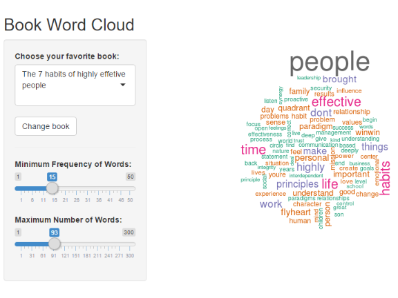

Book Word Cloud
========================================================
author: Stephanie
date: February 2016

What is Book Word Cloud?
========================================================

[Book Word Cloud](https://stephaniecnvs.shinyapps.io/Book-Word-Cloud/) is a Shiny App that creates a beautiful word cloud based on the words found in the book chosen.



This is an adaptation of the [Shiny word cloud App](http://shiny.rstudio.com/gallery/word-cloud.html).

How to use Book Word Cloud?
========================================================

1. Choose your **favorite book**
2. **Change book** and a word cloud appears based on the book chosen
3. Use slider *Minimum Frequency of Words* and *Maximum Number of Words* to change the **appearance of the word cloud**

***Note:*** There is a bug with the slider *Minimum Frequency of Words* which I need to fix

How did I build the Book Word Cloud?
========================================================

1. Load the text mining package (`tm`)
2. Read in your book (saved in your directy as `.txt`
3. Create a corpus and clean up the text with the [tm package](https://cran.r-project.org/web/packages/tm/vignettes/tm.pdf)


```r
library(tm)
text <- readLines("powerofnow.txt", encoding="UTF-8")
myCorpus = Corpus(VectorSource(text))
myCorpus = tm_map(myCorpus, content_transformer(tolower))
myCorpus = tm_map(myCorpus, removePunctuation)
myCorpus = tm_map(myCorpus, removeNumbers)
myCorpus = tm_map(myCorpus, removeWords,
                  c(stopwords("SMART"), "thy", "thou", "thee", "the", "and", "but"))
```

How did I build the Book Word Cloud?
=======================================================

Now load the `wordcloud` R package and create the Word Cloud!


```r
library(wordcloud)
wordcloud(myCorpus, scale=c(5,0.5), max.words=100, random.order=FALSE, rot.per=0.35, use.r.layout=FALSE, colors=brewer.pal(8, "Dark2"))
```


