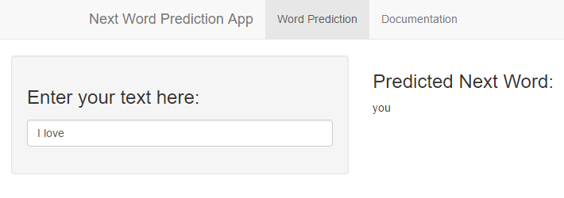

Next Word Prediction App
========================================================
author: Stephanie
date: March 2016

Data Science Specialization - Capstone Project  
Johns Hopkins University & SwiftKey  
Coursera

Overview
========================================================

The objective of this project is to build a **predictive text app** that is able to predict the next word of the text the user enters.  

To build this app, we used:

- A large corpus of text from [HC Corpora](www.corpora.heliohost.org)
- **Natural Language Processing** methods

This project is part of the *Data Science Capstone* from *Johns Hopkins University* and *SwiftKey* (company building smart keyboards using predictive text analytics).

How to use the App
========================================================

***

1. You enter the text of your choice in the **Enter you text here** input
2. The most likely next word appears at **Predicted next word**

Analysis & Prediction Algorithm
========================================================

1. **Cleaning** HC Corpora text data
2. **Tokenization into n-grams** stored in term frequency matrices: bigrams, trigrams and quadgrams
3. **Prediction Algorithm process**
    - Read the user input text
    - If user input text >= 3 words, take the last 3 words
    - Predict using quadgrams
    - If no prediction, back-off using trigrams
    - If no prediction, back-off using bigrams
    - Else return NA

Documentation
========================================================

The app is available on [ShinyApps.io](https://stephaniecnvs.shinyapps.io/Next_Word_Prediction/).  

Source codes (*ui.R*, *server.R* and *word_prediction.R*) are available on [GitHub](https://github.com/stephaniecan/data_science_capstone/tree/master/Next_Word_Prediction)

The Milestone Report (Exploratory Data Analysis) is available at [RPubs](http://rpubs.com/Stephaniecnvs/NLP-milestone-report).

